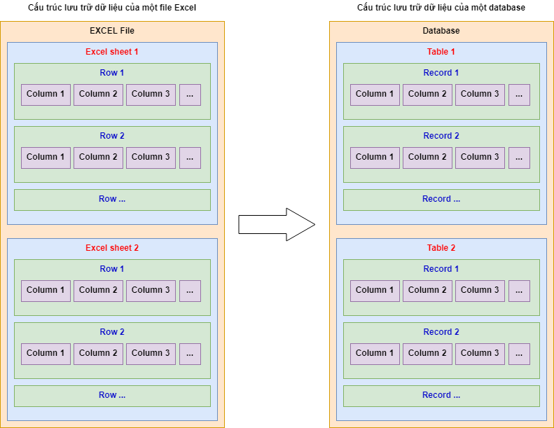

# MySQL

---

## Bài 1. Tổng quan, khái niệm về database và các thành phần trong database RDMS

---

### 1. Database là gì?

- Mục tiêu của database là:
  - Lưu trữ thông tin một cách tối ưu, gọn nhẹ, và có khả năng trả lời được các yêu cầu dữ liệu về nghiệp vụ trong thời gian ngắn (phục vụ cho nhu cầu Tìm kiếm / Truy vấn nhanh chóng và chính xác).
  - Có thể Truy vấn dữ liệu một cách nhanh chóng, chính xác, bất kể thời gian. Ví dụ:
    - Thống kê Sản phẩm nào bán chạy nhất trong 3 tháng gần đây?
    - Khách hàng nào là khách hàng thân thiết nhất của Shop (đã mua hàng nhiều nhất trong vòng 5 năm gần đây) ?
    - Bệnh nhân A đã từng bị tiền sử bệnh gì trong vòng 10 năm trước? Đã từng tiếp xúc những người nào trong thời gian Covid gần đây? ...
    - Nhân viên A còn bao lâu nữa đến thời hạn sẽ được Nâng lương/Nâng bậc?
    - ...

---

### 2. Tổng quan cách hình tượng từ file Excel về Database

- Excel là phần mềm khá quen thuộc với nhiều người. Chúng ta có thể đã từng sử dụng Excel để lưu trữ thông tin dữ liệu. Tuy việc lưu trữ bằng file Excel khá tiện lợi và nhanh chóng. Tuy nhiên, khi dữ liệu trở nên quá lớn (nhiều dòng dữ liệu), nhu cầu truy vấn và tìm kiếm của file Excel tỏ ra hạn chế. Chúng ta sẽ cần đến một cách lưu trữ tối ưu hơn cho việc lưu trữ dữ liệu lớn và tăng khả năng tìm kiếm.

- Hình sau đây là một cách hình tượng hóa từ file Excel quen thuộc về database:
  

- Dựa theo mô hình trên thì chúng ta có cấu trúc phân rã của file Excel và database như sau:
  

- Về cấu trúc, chúng ta sẽ đọc tiếng Việt như sau:

  - Về file Excel
    - Trong 1 file Excel, có thể có 1 hoặc nhiều Sheets.
    - Trong 1 Sheet, có thể có 1 hoặc nhiều dòng (Rows).
    - Trong 1 dòng (Row), có thể có 1 hoặc nhiều cột (Columns)
  - Về database
    - Trong 1 database, có thể có 1 hoặc nhiều Tables.
    - Trong 1 Table, có thể có 1 hoặc nhiều dòng (Records).
    - Trong 1 dòng (Record), có thể có 1 hoặc nhiều cột (Columns)

- Ví dụ:
  - Chúng ta có file Excel và Database dùng để lưu trữ thông tin dữ liệu bán hàng cho shop NetaShop như sau:
    
    

---
